<h1><i>Food For You</i></h1>
<h3>Full Project Download: Connect with Me ( deependra04trivedi@gmail.com )</h3>
<h4>Version: 1.0.1</h4>
<be>

<h2>Screenshots are give below</h2>

Website Link:&nbsp; <a href="https://food-for-you-deploy-85eee.web.app/" target="_blank">FoodForYou.com</a> 
    
<h5> OPEN IN Desktop Mode because some pages are not responsive</h5>
  <b>Disclaimer:</b> &nbsp;<i>Only Frontend deploy.So, You cannot access restaurant data,product data and not able to so some functionalities like login,register etc</i>.  

<ul>
  <li>It is full stack project</li>
  <li>In this project where user order online our favourite food or meal from  many restaurants</li>
  <li>Many functionalities avalibale in this project like login,register,forget password,notification etc.</li>
  <li>Rest API uses for the data communication.Handle and represent the data in frontend using Angular 14</li> 
  <li>This is the first version.So some function are not available yet.It will be available on next updates</li>
</ul>

<h3>Technology used</h3>
<ul>
  <li>Java + Spring Boot</li>
  <li>Microservice</li>
  <li>Feign Client</li>
  <li>Angular 14</li>
  <li>Ngrx + Rxjs</li>
  <li>Java Mail Sender</li>
  <li>JPA Repository</li>
  <li>MySql</li>
</ul>

<h2> Database Details:-</h2>
<ul>
  <li>DATABASE :- mysql</li>
  <li>Username :- root </li>
  <li>Password :- deependra</li>
  <li>Address :- 127.0.0.1</li>
</ul>

   
 <h2> Other Details:-</h2>
 <ul>
  <li> IDE: Spring Tool Suite (Back-End)</li>
  <li>SpringBoot Starter Project</li>
  <li>VS Code (Front-End)</li>
  <li> OS : LINUX (UBUNTU)  </li>
  <li>Address :- 127.0.0.1</li>
</ul>

<h2>Screenshots</h2>
<be>
  
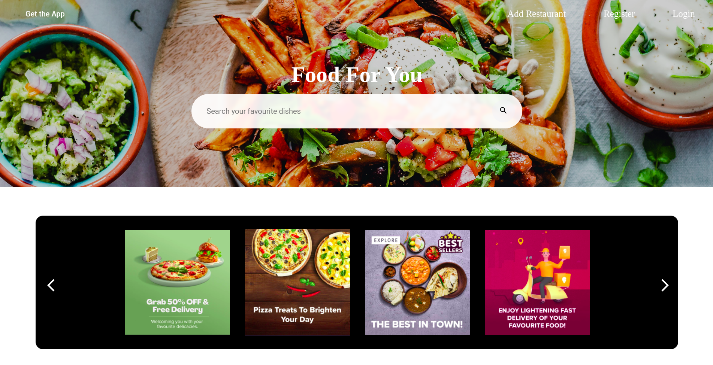
  
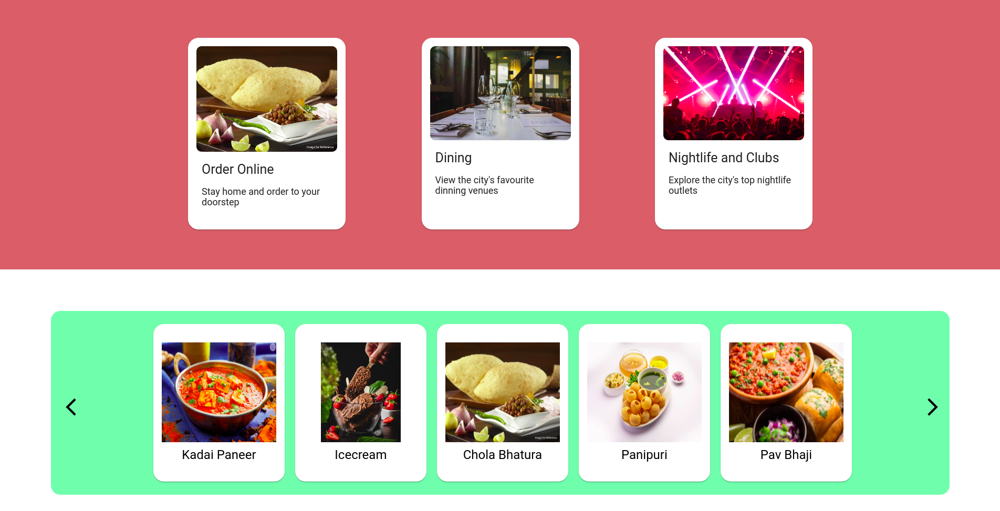

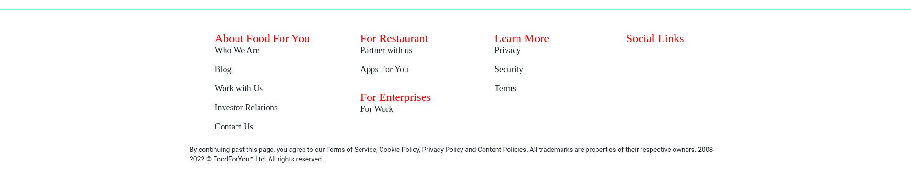

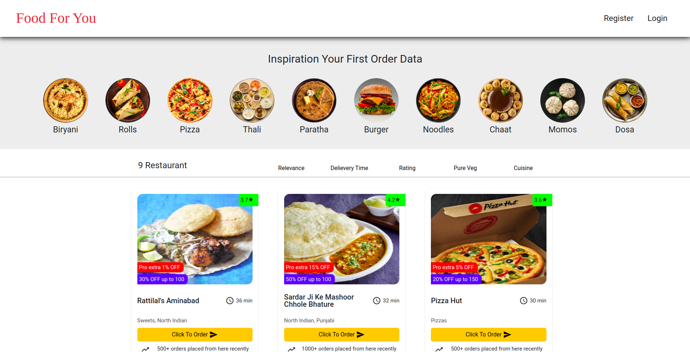

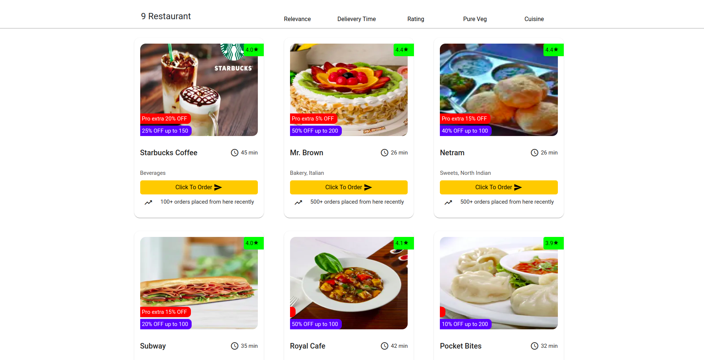

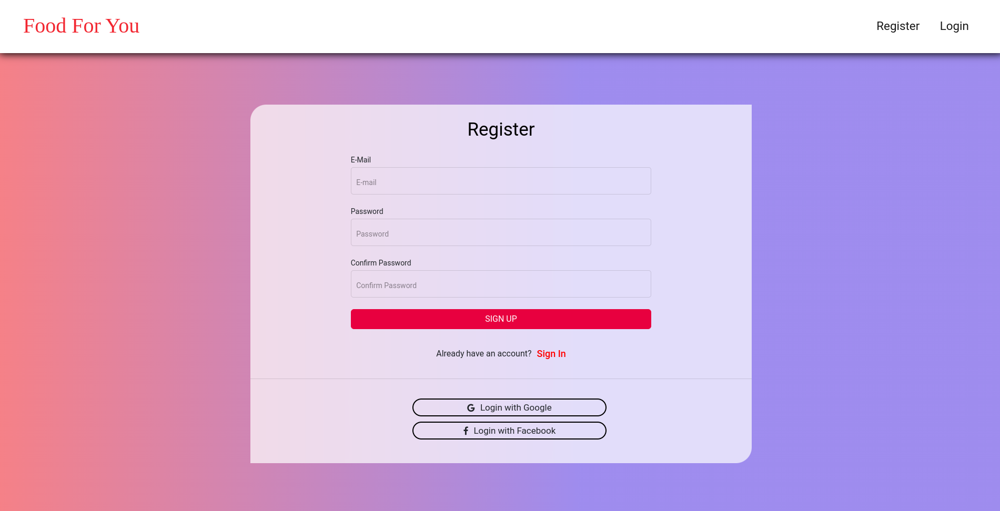

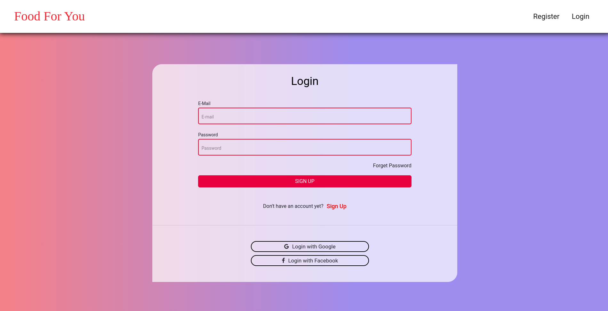

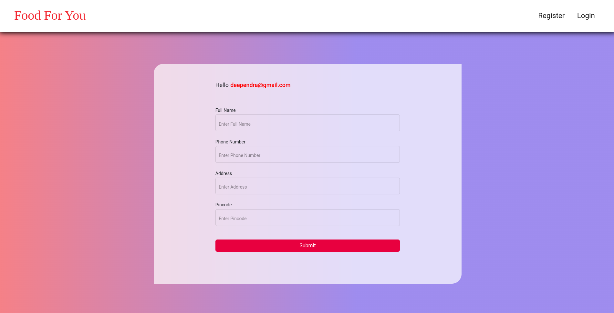

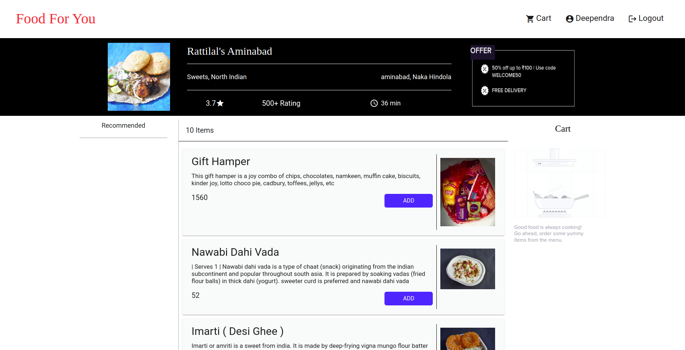

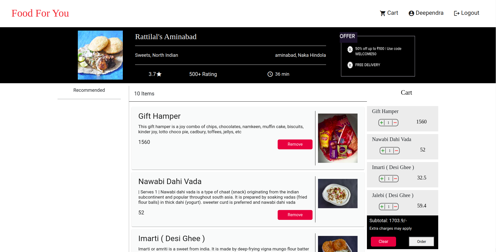

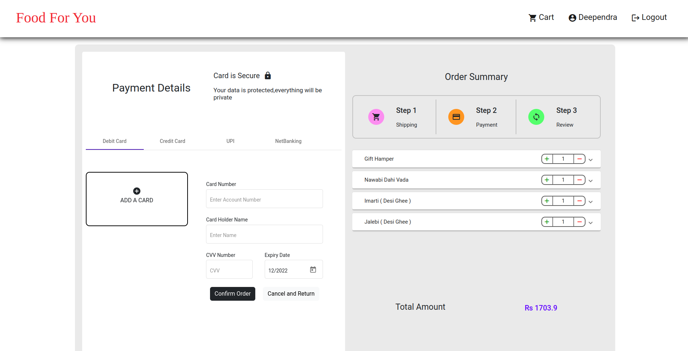

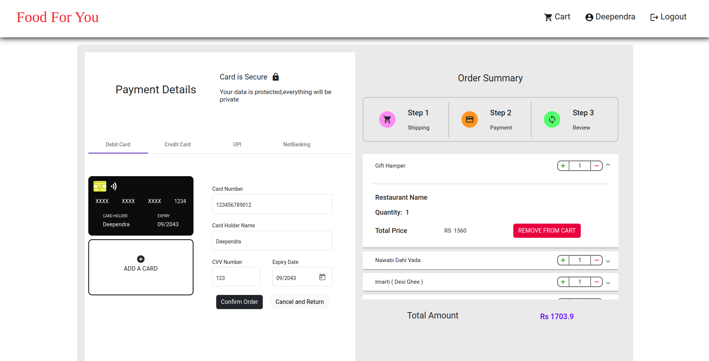

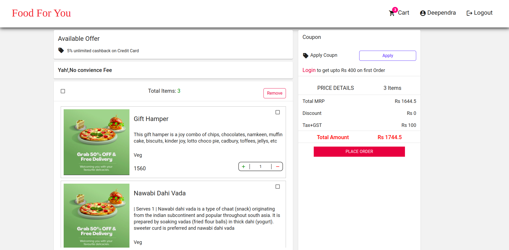

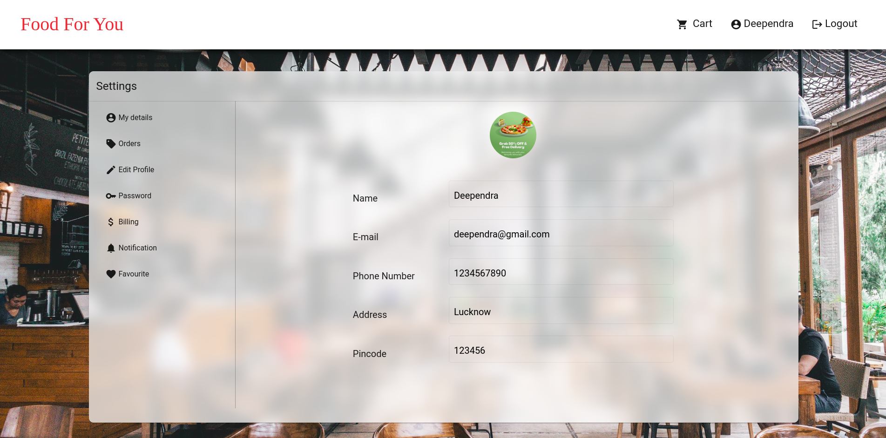

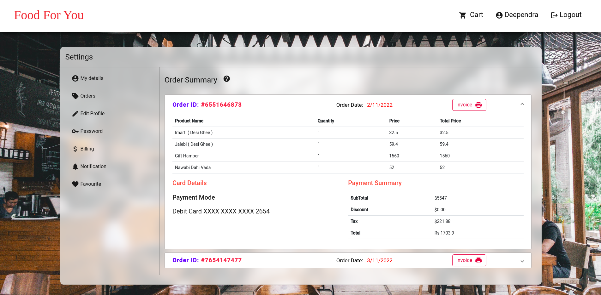

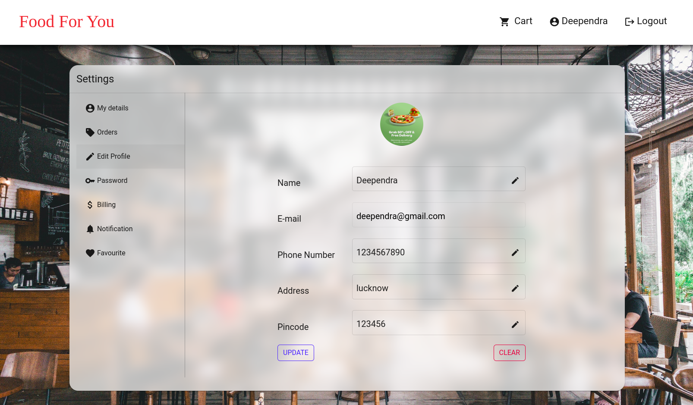

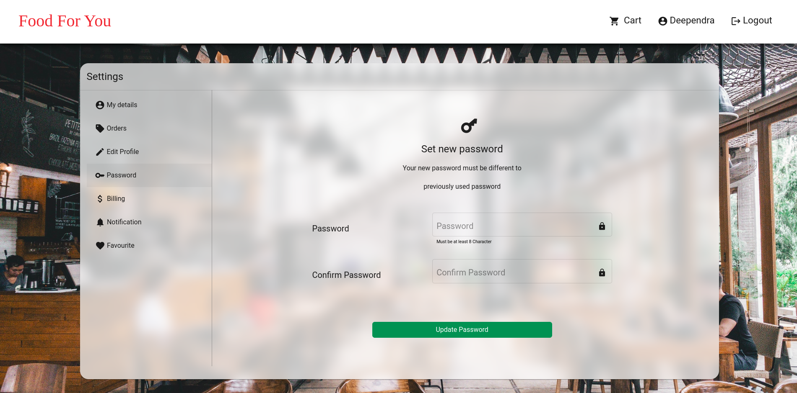

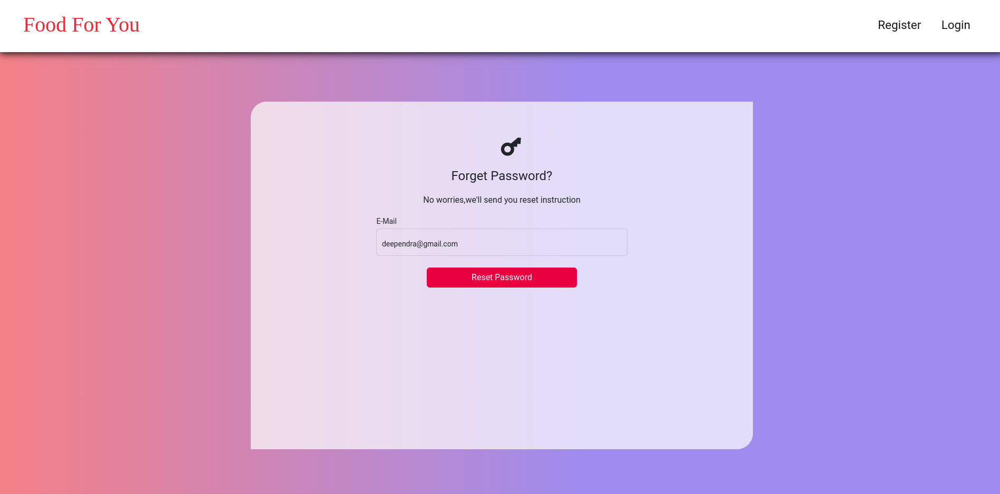

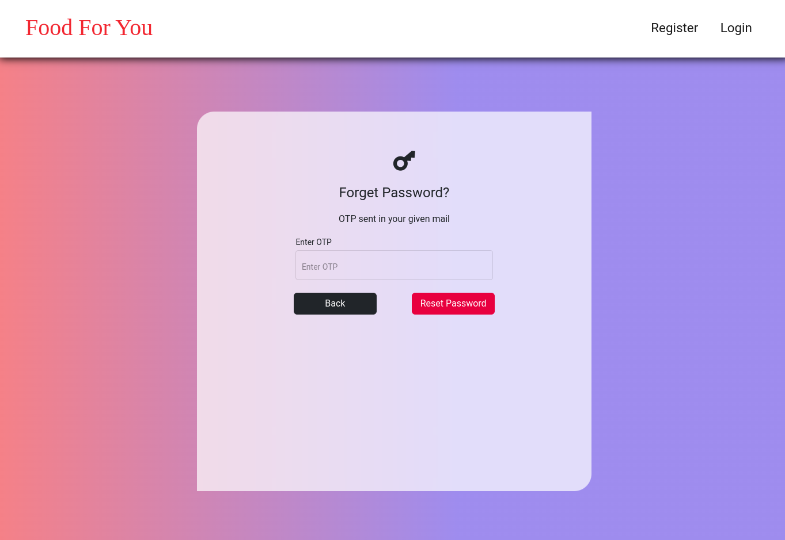

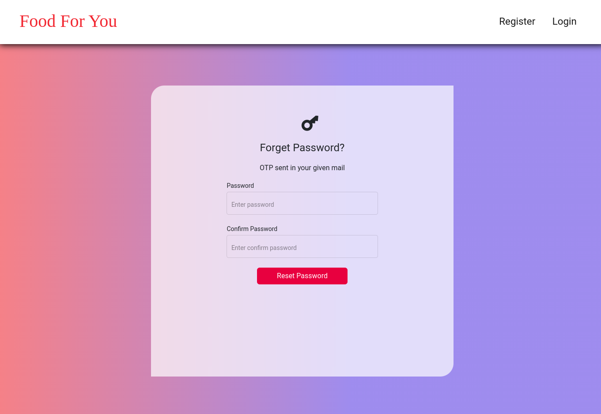

